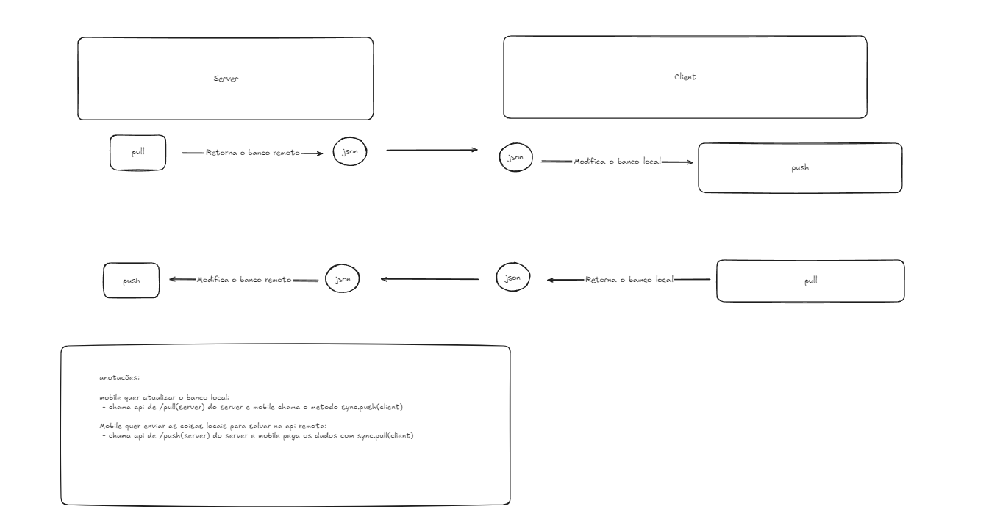

# About and  how works:
SSYNC.LiteDB aims to assist in the data synchronization flow between the backend, using .NET WebAPI/Minimal APIs, and the frontend, using .NET MAUI or Uno Platform, with LiteDB as the local database.


## To update local changes:


## To update server changes:

## 

## Flow (en-us):


## Flow pt-br:



⚠️⚠️ Important Notes:

* Your local and server databases must contain ID fields of type GUID, as well as fields for creation date, update date, and deletion date. To assist with this, you should use ISSyncEntityRoot in the backend, an abstract class to be used in your entities.

* Example your api server: 

```cs
// example entity from server

    public class Note : ISSyncEntityRoot
    {
        public const string CollectionName = nameof(Note);
        public Note()
        {
            
        }
        public Note(Guid id, Time time) : base(id, time)
        {
        }

        public string? Content { get; set; }
        public bool Completed { get; set; }
    }
```


*  Case your client to use  SchemaSync

```cs
// example client with .NET Maui
    public class Note : SchemaSync
    {
        public Note(Guid id) : base(id)
        {
        }

        public string? Content { get; set; }

        public bool Completed { get; set; }
    }
```
 
* Your server database você will work only soft delete.

* In your client, you must perform CRUD operations while always updating the date fields. To assist with this, Synchronize provides insert, update, and delete methods to abstract these operations. Using these methods is optional, as long as the date updates are performed.

* Your client if not change your database litedb, you need set first pull to get all changes from server e set last pullet At

```cs
// example repository client in .NET Maui.

    public class NoteRepository : INoteRepository
    {
        private Synchronize? _sync;
        private readonly LiteDatabase? _db;

        public NoteRepository()
        {
            _db = new LiteDatabase(GetPath());
            _sync = new Synchronize(_db);
        }


        public Task Save(Note note)
        {
            _sync!.InsertSync(note,"Note");

            return Task.CompletedTask;
        }

        public Task Update(Note note)
        {
            _sync!.UpdateSync(note, "Note");

            return Task.CompletedTask;
        }

        public Task Delete(Note note)
        {
            _sync!.DeleteSync(note, "Note");
            return Task.CompletedTask;
        }

		.....

```

* If you do not use Synchronize to delete fields in your local database, it is important to note that you must update the data (updating the date and status) instead of deleting it. You can use methods such as entity.CreatedAt() or entity.DeletedAt().


## Client:

### How install

[](https://www.nuget.org/packages/SSync.Client.LitebDB/)

 *  setup
 * To use methods to sync initialize the classe as:

```cs
public class SyncRepo
{
private Synchronize? _sync;
private readonly LiteDatabase? _db;

public SyncRepo()
{
	_db = new LiteDatabase(GetPath());
	_sync = new Synchronize(_db);
}

private string GetPath()
{
	var path = FileSystem.Current.AppDataDirectory;

#if WINDOWS

    return Path.Combine(path, "litedbwin.db");

#else

    return Path.Combine(path, "litedb.db");
	
#endif
}


public Task SetLastPulledAt(long lastPulledAt)
{
	_sync!.ReplaceLastPulledAt(lastPulledAt);
	return Task.CompletedTask;
}
public long GetLastPulledAt()
{
	return _sync!.GetLastPulledAt();
}


// ---------------  PUSH -------------------


//Load database server to my local
public Task PushServerChangesToLocal(string jsonServerChanges)
{
	var pushBuilder = new SyncPushBuilder(jsonServerChanges);

	pushBuilder
		.AddPushSchemaSync<Note>(change => _sync!.PushChangesResult(change), LiteDbCollection.Note)
		.AddPushSchemaSync<AnotherCollection>(change => _sync!.PushChangesResult(change), LiteDbCollection.AnotherNameCollection)
		.Build();

	return Task.CompletedTask;
}
	
// ---------------  PULL -------------------

	//send database local to server
public string PullLocalChangesToServer()
{
	var pullChangesBuilder = new SyncPullBuilder();

	var lastPulledAtSync = _sync!.GetLastPulledAt();

//Get Change from database litebd
	pullChangesBuilder
		.AddPullSync(() => _sync!.PullChangesResult<Note>(lastPulledAtSync, LiteDbCollection.Note))
		.AddPullSync(() => _sync!.PullChangesResult<AnotherCollection>(lastPulledAtSync, LiteDbCollection.AnotherNameCollection))
		.Build();

	var databaseLocal = pullChangesBuilder.DatabaseLocalChanges;
	var jsonDatabaseLocal = pullChangesBuilder.JsonDatabaseLocalChanges;

	return jsonDatabaseLocal;
}

```

## Sample my service and view model with flur ()

```cs
    public class ApiService : IApiService
    {
        private readonly ISyncRepo _syncService;

        public ApiService(SyncRepo syncService)
        {
            _syncService = syncService;
        }

        public async Task<int> PushServer()
        {

            //get local database
            var time = _syncService.GetLastPulledAt();
            var localDatabaseChanges = _syncService.PullLocalChangesToServer(time);

            //send local database to server
            var result = await "https://my-api.com"
                .AppendPathSegment("api/Sync/Push")
                .AppendQueryParam("Colletions", LiteDbCollection.Note)
                .AppendQueryParam("Colletions", LiteDbCollection.AnoterCollectionName)
                .AppendQueryParam("Timestamp", time)
                .WithHeader("Accept", "application/json")
                .WithHeader("Content-type", "application/json")
                .PostStringAsync(localDatabaseChanges);

            var resp = await result.ResponseMessage.Content.ReadAsStringAsync();

			//always need set lastPulletAt from response to your client litedb to know last sync with your server 
           await _syncService.SetLastPulledAt(long.Parse(resp));

            return result.StatusCode;
        }

        public async Task PullServer(bool firstPull)
        {
			//if true, get all change of server
            // get server database
            var time = firstPull ? 0 : _syncService.GetLastPulledAt();

            var result = await "https://my-api.com"
            .AppendPathSegment("api/Sync/Pull")
            .AppendQueryParam("Colletions", LiteDbCollection.Note)
            .AppendQueryParam("Colletions", LiteDbCollection.AnoterCollectionName)
            .AppendQueryParam("Timestamp", time)
            .GetAsync();

            var res = await result.ResponseMessage.Content.ReadAsStringAsync();

            //update local database from server

            await _syncService.PushServerChangesToLocal(res);
        }

    }
}

	// ViewModel

    public class NoteViewModel : INotifyPropertyChanged
    {

        private readonly IApiService _apiService;

		
        private void PullChangesNow()
        {
            _apiService.PullServer(firstPull:false);
        }

        private void PullAllChanges()
        {
            _apiService.PullServer(firstPull:true);
        }


        private void PushChanges()
        {
            _apiService.PushServer();
        }

```


# Backend

### How install

[](https://www.nuget.org/packages/SSync.Server.LitebDB/)


* Setup


```cs
// Sample entity
public class Note : ISSyncEntityRoot
{
	public const string CollectionName = nameof(Note);
	public Note()
	{
		
	}
	public Note(Guid id, Time time) : base(id, time)
	{
	}

	public string? Content { get; set; }
	public bool Completed { get; set; }
}

// Sample program.cs


// Create Class as like dto to you client

    public class NoteSync : ISchema
    {
        public NoteSync(Guid id) : base(id)
        {
        }

        public string? Content { get; set; }
        public bool Completed { get; set; }

    }


builder.Services.AddSSyncSchemaCollection<PocDbContext>(
    (pullChangesConfig) =>
    {
        pullChangesConfig
           .By<NoteSync>(Note.CollectionName);
    }, (pushChangesConfig) =>
    {
        pushChangesConfig
           .By<NoteSync>(Note.CollectionName);
    });


//Sample DbContext
// Set interface ISSyncDbContextTransaction

  public class PocDbContext : DbContext, ISSyncDbContextTransaction
    {
        private readonly IConfiguration _configuration;
        private IDbContextTransaction? transaction;

        public PocDbContext(DbContextOptions<PocDbContext> dbContextOptions, IConfiguration configuration) : base(dbContextOptions)
        {
            _configuration = configuration;
        }

        public DbSet<Note> Notes { get; set; }


        public async Task BeginTransactionSyncAsync()
            => transaction = await Database.BeginTransactionAsync();

        public async Task CommitSyncAsync()
            => await Database.CommitTransactionAsync();

        public Task CommitTransactionSyncAsync()
        {
            ArgumentNullException.ThrowIfNull(transaction);

            return transaction.CommitAsync();
        }

        public Task RollbackTransactionSyncAsync()
        {
            ArgumentNullException.ThrowIfNull(transaction);
            return transaction.RollbackAsync();
        }

// ------------ PULL -----------------------

    public class PullNotesRequestHandler : ISSyncPullRequest<NoteSync, SSyncParameter>
    {
        private readonly PocDbContext _db;

        public PullNotesRequestHandler(PocDbContext db)
        {
            _db = db;
        }

        public async Task<IEnumerable<NoteSync>> QueryAsync(SSyncParameter parameter)
        {
            var notes = await _db.Notes.Select(n => new NoteSync(n.Id)
            {
                Content = n.Content,
                Completed = n.Completed,
                CreatedAt = n.CreatedAt.ToUnixTimestamp(Time.UTC),
                DeletedAt = n.DeletedAt.ToUnixTimestamp(Time.UTC),
                UpdatedAt = n.UpdatedAt.ToUnixTimestamp(Time.UTC)
            }).ToListAsync();

            return notes;
        }
    }
}


// ------------ PUSH -----------------------

    public class PusNotesRequestHandler : ISSyncPushRequest<NoteSync>
    {
        private readonly PocDbContext _db;

        public PusNotesRequestHandler(PocDbContext db)
        {
            _db = db;
        }

        public async Task<NoteSync?> FindByIdAsync(Guid id)
        {
            return await _db.Notes
               .Where(n => n.Id == id)
               .Select(n => new NoteSync(id)
               {
                   Content = n.Content,
                   Completed = n.Completed,
                   CreatedAt = n.CreatedAt.ToUnixTimestamp(Time.UTC),
                   UpdatedAt = n.UpdatedAt.ToUnixTimestamp(Time.UTC),
                   DeletedAt = n.DeletedAt.ToUnixTimestamp(Time.UTC)
               }).FirstOrDefaultAsync();
        }

        public async Task<bool> CreateAsync(NoteSync schema)
        {
            var newNote = new Note(schema.Id, Time.UTC)
            {
                Content = schema.Content,
                Completed = schema.Completed
            };

            await _db.Notes.AddAsync(newNote);
            return await _db.SaveChangesAsync() > 0;
        }

        public async Task<bool> UpdateAsync(NoteSync schema)
        {
            var note = await _db.Notes.FirstOrDefaultAsync(n => n.Id == schema.Id);

            if (note is null)
                return false;

            note.Content = schema.Content;

            note.Completed = schema.Completed;

            note.SetUpdatedAt(DateTime.UtcNow);

            _db.Notes.Update(note);
            return await _db.SaveChangesAsync() > 0;
        }

		//Always works soft delete
        public async Task<bool> DeleteAsync(NoteSync schema)
        {
            var note = await _db.Notes.FirstOrDefaultAsync(n => n.Id == schema.Id);

            if (note is null)
                return false;


            note.SetDeletedAt(DateTime.UtcNow);

            _db.Notes.Update(note);
            return await _db.SaveChangesAsync() > 0;
        }
    }


``


