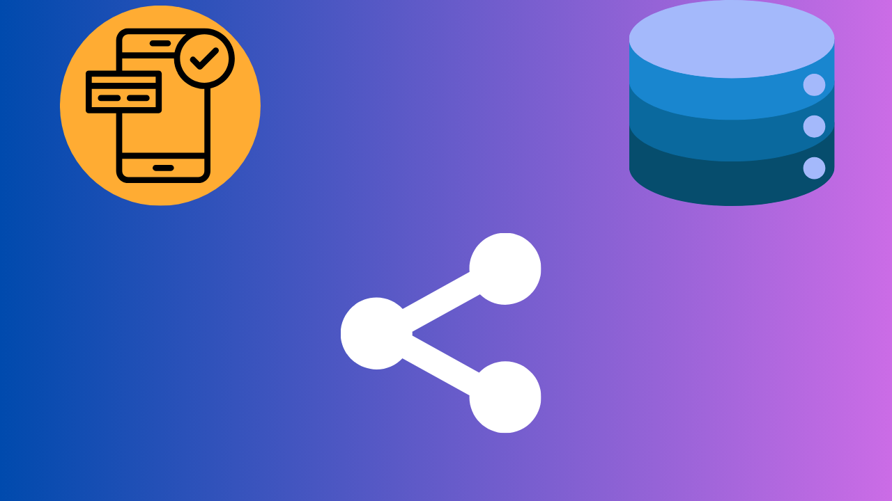
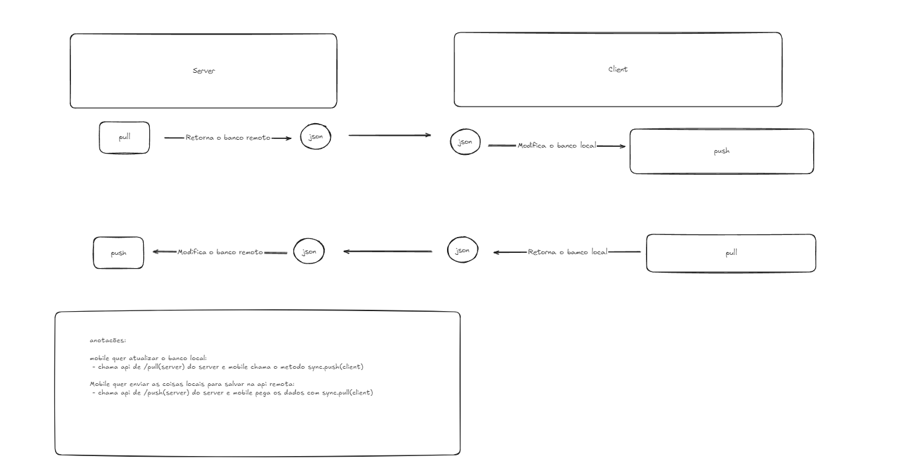
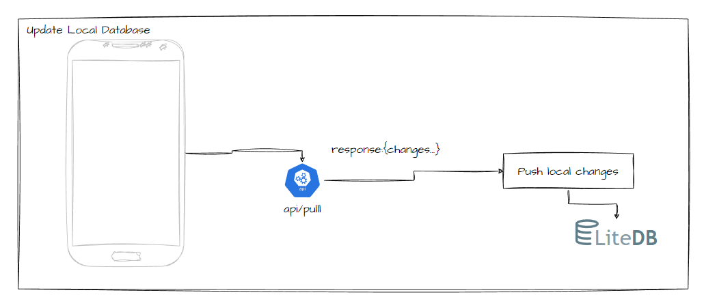
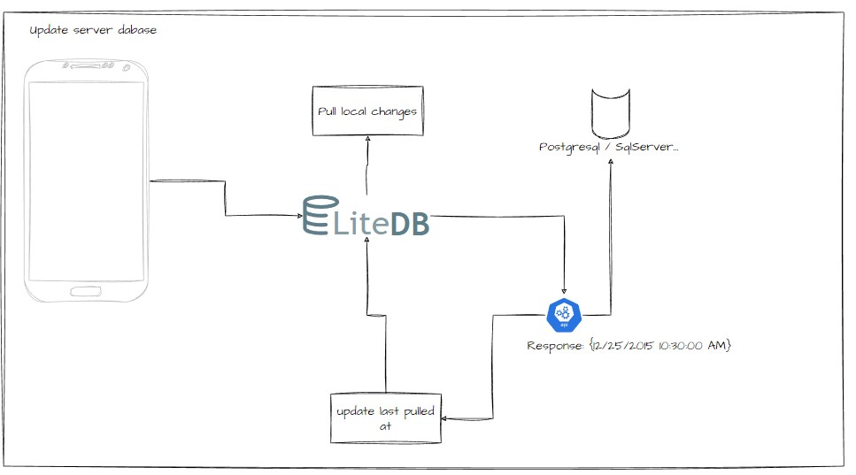

## Sobre:
SSYNC.LiteDB tem como objetivo facilitar a implementação de sincronização de dados entre frontend com litedb ou sqlite  e backend.

## ⚠️ Notas importante
- Sua base de dados local e do servidor sempre usará: 
    - - Guid com identificadores
    - - As tabelas que deverão realizar sincronia de dados deverão possui as seguintes colunas CreatedAt, UpdatedAt e DeletedAt? (timestamp)
    - -  A coluna DeletedAt é datetime nulável, logo você sempre trabalhará com softdelete
    - -  O  valor do timestamp 01-01T00:00:00.0000000 (iso) ou 1/1/0001 12:00:00 AM é usado como refência para carregar todos os dados do servidor
    - -  Em suas transações de dados, você deverá sempre com tipo formato de dados (utc ou local), tanto para server e client
    - -  A estrutura de dados (schemas) devem seguir a mesma para server e client e nome da chave dos objetos
    - - Objetos excluídos são sempre representados apenas por seus IDs.
   - - Estrutura de json válida
    ```json
        [
            {
                collection: table1_key_name,
                timestamp: Datetime iso like //2024-12-21T17:37:41.7618382Z ,
                changes:{
                    created: dtoSync[],
                    updated: dtoSync[],
                    deleted: string[],
                }  
            },
            {
                collection: table2_key_name,
                timestamp: Datetime iso like //2024-12-21T17:37:41.7618382Z ,
                changes:{
                    created: dtoSync[],
                    updated: dtoSync[],
                    deleted: string[],
                }  
            }
        ]
    ``` 
   - - Exemplo

   ```json
        [
            {
                "collection": "ss_tb_user",
                "timestamp": "2024-12-21T17:37:41.7618382Z",
                "changes": {
                    "created": [
                        {
                            "name": "John Doe 45",
                            "age": 45,
                            "id": "a6ea4282-a3ea-4893-ba50-e11e673030ef",
                            "createdAt": "2024-12-21T17:25:53.961871",
                            "updatedAt": "2024-12-21T17:25:53.961871",
                            "deletedAt": null
                        },
                        {
                            "name": "John Doe 19",
                            "age": 19,
                            "id": "f878dac6-690a-4f5e-b929-5ebecb1cd434",
                            "createdAt": "2024-12-21T17:25:54.689497",
                            "updatedAt": "2024-12-21T17:25:54.689497",
                            "deletedAt": null
                        }
                    ],
                    "updated": [],
                    "deleted": [
                        "7897a793-6298-42e4-b1f9-bb6daa8fe948"
                    ]
                }
            },
            {
                "collection": "ss_tb_note",
                "timestamp": "2024-12-21T17:37:42.8157339Z",
                "changes": {
                    "created": [
                        {
                            "completed": false,
                            "message": "new note",
                            "userName": "John Doe 19",
                            "id": "66c2eb1e-14f3-4ec7-8afd-84f54a42287b",
                            "createdAt": "2024-12-21T17:26:11.350763",
                            "updatedAt": "2024-12-21T17:26:11.350763",
                            "deletedAt": null
                        },
                        {
                            "completed": false,
                            "message": "new note",
                            "userName": "John Doe 19",
                            "id": "b7c66d5b-ea12-4710-a985-436942b0e938",
                            "createdAt": "2024-12-21T17:26:16.925801",
                            "updatedAt": "2024-12-21T17:26:16.925801",
                            "deletedAt": null
                        }
                    ],
                    "updated": [],
                    "deleted": []
                }
            }
        ]
   ```    

## 📽️ YouTube
[](https://www.youtube.com/watch?v=dSAaEAqkMZY?si=zPHq9BhFZ2Usju81)
[](https://www.youtube.com/watch?v=DqrYprDl0H2ebjZ2)
[](https://www.youtube.com/watch?v=Fr49m1ocRK0iDmlv)
[](https://www.youtube.com/watch?v=Fr49m1ocRK0iDmlv)


## 🔄️ Fluxo



## To update local changes:



## To update server changes:

## 

Atualmente suporta:

* Servidor: ASP.NET 8
* Cliente: .NET 8

Plataform clientes:

* [Avalonia UI](https://www.avaloniaui.net/)
* [.NET MAUI](https://dotnet.microsoft.com/apps/maui)
* [Uno Platform](https://platform.uno/)

## 📦 NuGet Packages

| Pacote | Tipo 
|---------|---------
| [SSync.Client.LitebDB](https://www.nuget.org/packages/SSync.Client.LitebDB) | Cliente
| [SSync.Client.SQLite](SSync.Client.SQLite) | Cliente 
| [SSync.Server.LitebDB](https://www.nuget.org/packages/SSync.Server.LitebDB) | Servidor

<details open>
<summary><h2>🔙 Backend</h2></summary>

### Como instalar


[](https://www.nuget.org/packages/SSync.Server.LitebDB/)

### ⛏️ Configuração

1. Para configuração dos seu modelo de dados você pode herdar ISSyncEntityRoot, será criado as colunas necessárias para gerencia sincronia

```cs
// example entity from server

public class Note : ISSyncEntityRoot
{
    public const string CollectionName = "ss_tb_note";
    
    public Note()
    {
        
    }
    public Note(Guid id, Time time) : base(id, time)
    {
    }

    
    public bool Completed { get; set; }
    public string? Message { get; set; } 
    public Guid? UserId{ get; set; }
    public virtual User? User { get; set; }

}
```

2. Configurar sua modelo de classe (schema) que irá representar objeto de dados da sincronia

```cs
// example dto to shared data

public class NoteSync : ISchema
{
    public NoteSync(Guid id) : base(id)
    {
    }

    public bool Completed { get; set; }

    public string? Message { get; set; }

    public string? UserName { get; set; }
}
```


3. Configurar Dbcontext, ele deverá herdar ISSyncDbContextTransaction

```cs

//sample dbcontext with postgresql

public class PocDbContext : DbContext, ISSyncDbContextTransaction
{
    private IDbContextTransaction? _transaction;
    private readonly IConfiguration _configuration;

    public PocDbContext(DbContextOptions<PocDbContext> options, IConfiguration configuration) : base(options)
    {
        //fix :https://github.com/npgsql/npgsql/issues/4246
        AppContext.SetSwitch("Npgsql.EnableLegacyTimestampBehavior", true);
        AppContext.SetSwitch("Npgsql.DisableDateTimeInfinityConversions", true);
        _configuration = configuration;
    }

    public DbSet<User> Users { get; set; }
    public DbSet<Note> Notes { get; set; }


    public async Task BeginTransactionSyncAsync()
        => _transaction = await Database.BeginTransactionAsync();

    public async Task CommitSyncAsync()
        => await Database.CommitTransactionAsync();

    public Task CommitTransactionSyncAsync()
    {
        ArgumentNullException.ThrowIfNull(_transaction);

        return _transaction.CommitAsync();
    }

    public Task RollbackTransactionSyncAsync()
    {
        ArgumentNullException.ThrowIfNull(_transaction);
        return _transaction.RollbackAsync();
    }

    protected override void OnConfiguring(DbContextOptionsBuilder optionsBuilder)
    {
        optionsBuilder.UseNpgsql(_configuration.GetConnectionString("PocServerSync"));
    }

    protected override void OnModelCreating(ModelBuilder modelBuilder)
    {
        modelBuilder.Entity<Note>()
            .HasOne(n => n.User)
            .WithMany(n => n.Notes)
            .OnDelete(DeleteBehavior.Restrict);


        
        modelBuilder.Entity<User>()
            .HasMany(n => n.Notes)
            .WithOne(n => n.User)
            .OnDelete(DeleteBehavior.Restrict);
    }
}

```

4. Agora você deverá criar suas classe pull handler, ela irá auxiliar no download da estrutura de sicronia, ela deve Implementar da interface ISSyncPullRequest<ISchema, SSyncParameter>

```cs
// ~/Sync.Handlers.Pull/NotePullRequestHandler.cs

public class NotePullRequestHandler : ISSyncPullRequest<NoteSync, SSyncParameter>
{
    private readonly ILogger<NotePullRequestHandler> _logger;
    private readonly PocDbContext _pocDbContext;

    public NotePullRequestHandler(ILogger<NotePullRequestHandler> logger, PocDbContext pocDbContext)
    {
        _logger = logger;
        _pocDbContext = pocDbContext;
    }

    public async Task<IEnumerable<NoteSync>> QueryAsync(SSyncParameter parameter)
    {
        _logger.LogInformation("Not sync  pull");

        var notes = _pocDbContext.Notes.AsQueryable();

        if (parameter.UserId.HasValue)
        {
            notes = notes.Where(x => x.UserId == parameter.UserId);
        }

        return await notes.Select(n => new NoteSync(n.Id)
        {
            Completed = n.Completed,
            CreatedAt = n.CreatedAt,
            UpdatedAt = n.UpdatedAt,
            Message = n.Message,
            DeletedAt = n.DeletedAt,
            UserName = n.User!.Name
        }).ToListAsync();
    }
}

```
5. Agora você deverá criar suas classe push handler, ela irá auxiliar no crud de dados da estrutura de sicronia, ela deve Implementar da interface ISSyncPushRequest<ISchema>

```cs
// ~/Sync.Handlers.Push/NotePushRequestHandler.cs

    public class NotePushRequestHandler(PocDbContext context) : ISSyncPushRequest<NoteSync>
    {
        private readonly PocDbContext _context = context;

        public async Task<NoteSync?> FindByIdAsync(Guid id)
        {
            return await _context.Notes.Where(u => u.Id == id)
                .Select(u => new NoteSync(id)
                {
                    Completed = u.Completed,
                    Message = u.Message,
                    UserName = u.User!.Name,
                    CreatedAt = u.CreatedAt,
                    DeletedAt = u.DeletedAt,
                    UpdatedAt = u.UpdatedAt
                }).FirstOrDefaultAsync();
        }

        public async Task<bool> CreateAsync(NoteSync schema)
        {
            var userId = await _context.Users
                .Where(s => s.Name == schema.UserName)
                .Select(u => u.Id)
                .FirstOrDefaultAsync();

            var newNote = new Note(schema.Id, Time.UTC)
            {
                Completed = schema.Completed,
                Message = schema.Message,
                UserId = userId
            };

            await _context.Notes.AddAsync(newNote);

            return await Save();
        }

        public async Task<bool> UpdateAsync(NoteSync schema)
        {
            var entity = await _context.Notes.FindAsync(schema.Id);

            entity!.Completed = schema.Completed;
            entity.Message = schema.Message;

            entity.SetUpdatedAt(DateTime.UtcNow);

            _context.Notes.Update(entity);

            return await Save();
        }

        public async Task<bool> DeleteAsync(NoteSync schema)
        {
            var entity = await _context.Notes.FindAsync(schema.Id);

            entity!.Completed = schema.Completed;
            entity.Message = schema.Message;

            entity.SetDeletedAt(DateTime.UtcNow);

            _context.Notes.Update(entity);

            return await Save();
        }

        private async Task<bool> Save()
        {
            return await _context.SaveChangesAsync() > 0;
        }
    }

```

6. Agora você deve configurar seu program.cs 


```cs

builder.Services.AddSSyncSchemaCollection<PocDbContext>(
    optionsPullChanges:(pullChangesConfig) =>
    {
        pullChangesConfig
            .By<UserSync>(User.CollectionName)
            .ThenBy<NoteSync>(Note.CollectionName);
    },
    optionsPushChanges: (pushChangesConfig) =>
    {
        pushChangesConfig
            .By<UserSync>(User.CollectionName)
            .ThenBy<NoteSync>(Note.CollectionName);
    });

```


7. Agora você pode utilizar as interface ISchemaCollection para realizar pull ou push no seu controller ou endpoint

```cs
 // endpoint
 var syncGroup = app.MapGroup("api/sync").WithOpenApi();

syncGroup.MapGet("/pull", async ([AsParameters] SSyncParameter parameter, [FromServices] ISchemaCollection schemaCollection) =>
{
    var changes = await schemaCollection.PullChangesAsync(parameter);
    
    return Results.Ok(changes);
});

syncGroup.MapPost("/push", async (HttpContext httpContext, [FromBody] JsonArray changes, [FromServices] ISchemaCollection schemaCollection) =>
{
    var query = httpContext.Request.Query;

    var sucesso = Guid.TryParse(query["userId"], out var userId);
    var parameter = new SSyncParameter
    {
        UserId = sucesso ? userId : null,
        Colletions = query["collections"].ToArray()!,
        Timestamp = DateTime.TryParse(query["timestamp"], out DateTime timestamp) ? timestamp : DateTime.MinValue
    };


    var now = await schemaCollection.PushChangesAsync(changes, parameter);

    return Results.Ok(now);
});

  
 // controller
[Route("[action]")]
[HttpGet]
public async Task<IActionResult> Pull([FromQuery] SSyncParameter parameter, [FromServices] ISchemaCollection schemaCollection)
{
    return Ok(await schemaCollection.PullChangesAsync(parameter));
}

[Route("[action]")]
[HttpGet]
public IAsyncEnumerable<object> PullStream([FromQuery] SSyncParameter parameter, [FromServices] ISchemaCollection schemaCollection)
{
    return schemaCollection.PullStreamChanges(parameter);
}

```

8. Você possui a possibilidade de herdar da classe SSyncParameter e fornecer campos e dados disponivel em todo seus handlers de pull

```cs
public class CustomParamenterSync : SSyncParameter
{
    public Guid? UserId { get; set; }
    public string? phoneId { get; set; }
}

```


9. (opcional) Caso não queira criar endpoint de pull e push manualmente, você pode chamada função MapApiEndpointsSync, é  obrigatório passar um tipo customizado que herda de SSyncParameter, 
assim que irá injectar automaticamente endpoints para realizar as operações

```cs
app.MapApiEndpointsSync<CustomParamenterSync>();
```


</details>

<details open>
<summary><h2>📱 Client</h2></summary>

### Como instalar

[](https://www.nuget.org/packages/SSync.Client.LitebDB/)

### ⛏️ Configuração


1. Suas entidades devem herdar da classe SchemaSync

```cs
    public class Note : SchemaSync
    {
        public Note(Guid id) : base(id, SSync.Client.LitebDB.Enums.Time.UTC)
        {
        }

        public string? Content { get; set; }

        public bool Completed { get; set; }
    }
```

(Opcional) 1.1. Nome das tabelas devem ser unicos e igual do seu backend

```cs
   public static class LiteDbCollection
    {
        public const string Note = "ss_tb_note";
    }
}

```
2. Suas operações de dados (crud), devem ser aplicadas usando a classe Synchronize

<b>No LiteDB</b>:
```cs
public class NoteRepo : INoteRepo
{
 
    public List<Note> GetNotes()
    {
        using var db = new LiteDatabase(Database.GetPath());
        return db!
            .GetCollection<Note>(Note.CollectionName)
            .FindAll()
            .OrderByDescending(u => u.CreatedAt)
            .ToList();
    }

    public Note GetNoteBydId(Guid id)
    {
        using var db = new LiteDatabase(Database.GetPath());
        return db!
            .GetCollection<Note>(Note.CollectionName)
            .FindById(id);
    }

    public Task Save(Note entity)
    {
        using var db = new LiteDatabase(Database.GetPath());
        var sync = new Synchronize(db);
        sync!.InsertSync(entity, Note.CollectionName);

        return Task.CompletedTask;
    }

    public Task Update(Note entity)
    {
        using var db = new LiteDatabase(Database.GetPath());
        var sync = new Synchronize(db);
        sync!.UpdateSync(entity, Note.CollectionName);

        return Task.CompletedTask;
    }


    public Task Delete(Note entity)
    {
        using var db = new LiteDatabase(Database.GetPath());
        var sync = new Synchronize(db);
        sync!.DeleteSync(entity, Note.CollectionName);

        return Task.CompletedTask;
    }


    public Task Drop()
    {
        using var db = new LiteDatabase(Database.GetPath());

        db!.GetCollection<Note>().DeleteAll();
        return Task.CompletedTask;
    }

}

```

<b>Em SQLite</b>:
```cs
    public class NoteRepo : INoteRepo
    {
        SQLiteAsyncConnection? Db;

        async Task Init()
        {
            if (Db is not null)
                return;

            Db = new SQLiteAsyncConnection(ContantsSqlite.DatabasePath, ContantsSqlite.Flags);
            var result = await Db.CreateTableAsync<Note>();
        }

        public async Task<List<Note>> GetNotes()
        {
            await Init();
            var db = new SQLiteAsyncConnection(ContantsSqlite.DatabasePath, ContantsSqlite.Flags);
            return await db!
                .Table<Note>()
                .OrderByDescending(u => u.CreatedAt)
                .ToListAsync();
        }

        public async Task<Note> GetNoteBydId(Guid id)
        {
            await Init();

            var db = new SQLiteAsyncConnection(ContantsSqlite.DatabasePath, ContantsSqlite.Flags);
            return await db!
                .Table<Note>()
                .FirstAsync(e => e.Id.Equals(id));
        }

        public async Task Save(Note entity)
        {
            await Init();

            var db = new SQLiteAsyncConnection(ContantsSqlite.DatabasePath, ContantsSqlite.Flags);
            var sync = new Synchronize(db);
            await sync!.InsertSyncAsync(entity);
        }

        public async Task Update(Note entity)
        {
            await Init();

            var db = new SQLiteAsyncConnection(ContantsSqlite.DatabasePath, ContantsSqlite.Flags);
            var sync = new Synchronize(db);
            await sync!.UpdateSyncAsync(entity);
        }

        public async Task Delete(Note entity)
        {
            await Init();

            var db = new SQLiteAsyncConnection(ContantsSqlite.DatabasePath, ContantsSqlite.Flags);
            var sync = new Synchronize(db);
            await sync!.DeleteSyncAsync(entity);
        }

        public async Task Drop()
        {
            await Init();

            var db = new SQLiteAsyncConnection(ContantsSqlite.DatabasePath, ContantsSqlite.Flags);

            await db!.DeleteAllAsync<Note>();
        }

```


3. Agora crie sua classe repository de sincronia, ela possuirá responsabilidade de carregar dados de sua base de dados local ou enviá-las

<b>No LiteDB</b>:
```cs
public class SyncRepository : ISyncRepository
    {
        //send database local to server
        public string PullLocalChangesToServer(DateTime lastPulledAt)
        {
            var pullChangesBuilder = new SyncPullBuilder();

            var last = _sync!.GetLastPulledAt();
            pullChangesBuilder
                .AddPullSync(() => _sync!.PullChangesResult<Note>(last, LiteDbCollection.Note))
                // if more table to get  
                .AddPullSync(() => _sync!.PullChangesResult<AnotherTable>(last, LiteDbCollection.AnotherTable))
                .Build();

            var databaseLocal = pullChangesBuilder.DatabaseLocalChanges;
            var jsonDatabaseLocal = pullChangesBuilder.JsonDatabaseLocalChanges;

            return jsonDatabaseLocal;
        }

        //Load database server to my local
        public Task PushServerChangesToLocal(string jsonServerChanges)
        {
            var pushBuilder = new SyncPushBuilder(jsonServerChanges);

            pushBuilder
                .AddPushSchemaSync<Note>(change => _sync!.PushChangesResult(change), LiteDbCollection.Note)
                   // if more table to send  
                .AddPullSync(() => _sync!.PullChangesResult<AnotherTable>(last, LiteDbCollection.AnotherTable))
                .Build();

            return Task.CompletedTask;
        }

        // save last date did changes
        public Task SetLastPulledAt(DateTime lastPulledAt)
        {
           _sync!.ReplaceLastPulledAt(lastPulledAt);
            return Task.CompletedTask;
        }

        // get last date did changes
        public DateTime GetLastPulledAt()
        {
            return _sync!.GetLastPulledAt();
        }

    }

```

<b>Em SQLite</b>:

```cs
    public class SyncRepository : ISyncRepository
    {
        public async Task<string> PullLocalChangesToServer(DateTime lastPulledAt)
        {
            var db = new SQLiteAsyncConnection(ContantsSqlite.DatabasePath, ContantsSqlite.Flags);
            using var sync = new Synchronize(db);

            var pullChangesBuilder = new SyncPullBuilder();

            var last = await sync!.GetLastPulledAtAsync();

           await pullChangesBuilder
                .AddPullSync(() => sync!.PullChangesResultAsync<User>(last, User.CollectionName))
                .AddPullSync(() => sync!.PullChangesResultAsync<Note>(last, Note.CollectionName))
                .AddPullSync(() => sync!.PullChangesResultAsync<Doc>(last, Doc.CollectionName))
                .BuildAsync();

            var databaseLocal = pullChangesBuilder.DatabaseLocalChanges;
            var jsonDatabaseLocal = pullChangesBuilder.JsonDatabaseLocalChanges;

         

            return jsonDatabaseLocal!;
        }

        //Load database server to my local
        public async Task PushServerChangesToLocal(string jsonServerChanges)
        {
            var db = new SQLiteAsyncConnection(ContantsSqlite.DatabasePath, ContantsSqlite.Flags);
            using var sync = new Synchronize(db);

            var pushBuilder = new SyncPushBuilder(jsonServerChanges);

            await pushBuilder
                .AddPushSchemaSync<User>(sync!.PushChangesResultAsync, User.CollectionName)
                .AddPushSchemaSync<Note>(sync!.PushChangesResultAsync, Note.CollectionName)
                .BuildAsync();
        }
    }
```

4. Agora implemetação do seu service de sincronia.<br/>
O exemplo também está incluso como fazer upload de documentos.

<b>In LiteDB</b>:

```cs

    public class ApiService : IApiService
    {
        private readonly ISyncRepository _syncRepository;

        public ApiService(ISyncRepository syncRepository)
        {
            _syncRepository = syncRepository;
        }

        public async Task<DateTime> PushServerAsync()
        {
            using var db = new LiteDatabase(Database.GetPath());
            using var sync = new Synchronize(db);
            //get local database
            var time = sync.GetLastPulledAt();
            db.Dispose();
            var localDatabaseChanges = _syncRepository.PullLocalChangesToServer(time);

            Guid? userIdLogged = null; //get id user logged for example

            //send local database to server
            var result = await EndPoint.BaseURL
                .AppendPathSegment("api/Sync/Push")
                .AppendQueryParam("Collections", User.CollectionName)
                .AppendQueryParam("Collections", Note.CollectionName)
                .AppendQueryParam("Collections", Doc.CollectionName)
                .AppendQueryParam("UserId", userIdLogged)
                .AppendQueryParam("Timestamp", time)
                .WithHeader("Accept", "application/json")
                .WithHeader("Content-type", "application/json")
                .PostStringAsync(localDatabaseChanges);

            var resp = await result.ResponseMessage.Content.ReadAsStringAsync();

            var dta = System.Text.Json.JsonSerializer.Deserialize<DateTimeOffset>(resp);
            sync.ReplaceLastPulledAt(dta.Date);

            return time;
        }

        // call method after push sync data, to use same timestamp of sync data
        public async Task<List<Doc>> PushDocsToServerAsync(DateTime timestamp)
        {
            using var db = new LiteDatabase(Database.GetPath());

            using var sync = new Synchronize(db);

            var synDocs = sync!.PullChangesResult<Doc>(timestamp, Doc.CollectionName);

            var allDocToUpload = new List<Doc>();

            var docsCreated = synDocs.Changes.Created.Select(sdc => new Doc()
            {
                Id = sdc.Id,
                Path = sdc.Path,
                Status = sdc.Status,
                CreatedAt = sdc.CreatedAt,
                UpdatedAt = sdc.UpdatedAt,
                Name = sdc.Name,
                FileName = sdc.FileName,
                DeletedAt = sdc.DeletedAt,
            });

            var docsUpdate = synDocs.Changes.Updated.Select(sdc => new Doc()
            {
                Id = sdc.Id,
                Path = sdc.Path,
                Status = sdc.Status,
                CreatedAt = sdc.CreatedAt,
                UpdatedAt = sdc.UpdatedAt,
                Name = sdc.Name,
                FileName = sdc.FileName,
                DeletedAt = sdc.DeletedAt,
            });


            allDocToUpload.AddRange(docsCreated);

            allDocToUpload.AddRange(docsUpdate);


            var allDocToUploadError = new List<Doc>();


            foreach (var doc in allDocToUpload)
            {
                using var form = new MultipartFormDataContent();
                
                var fileStream = File.OpenRead(doc.Path);
                var fileContent = new StreamContent(fileStream);
                fileContent.Headers.ContentType = new MediaTypeHeaderValue("application/octet-stream");
                form.Add(fileContent, "files", Path.GetFileName(doc.Path));
                
                //send files to server
                var result = await EndPoint.BaseURL
                    .AppendPathSegment("api/Sync/doc-up")
                    .AppendQueryParam("DocId", doc.Id)
                    .PostMultipartAsync(mp => mp
                        .AddFile("file1", doc.Path, "application/octet-stream")                    // local file path
                        // .AddFile("file2", stream, "foo.txt")
                    );

                var resp = await result.ResponseMessage.Content.ReadAsStringAsync();

                if (result.StatusCode != 200)
                {
                    allDocToUploadError.Add(doc);
                }
            }

            return allDocToUploadError;
        }


        public async Task PullServerAsync(bool all)
        {
            using var db = new LiteDatabase(Database.GetPath());
            using var sync = new Synchronize(db);

            // get server database
            var time = all ? DateTime.MinValue : sync.GetLastPulledAt();
            var result = await EndPoint.BaseURL
                .AppendPathSegment("api/Sync/Pull")
                .AppendQueryParam("Colletions", User.CollectionName)
                .AppendQueryParam("Colletions", Note.CollectionName)
                .AppendQueryParam("Timestamp", time.ToString("o"))
                .GetAsync();

            var res = await result.ResponseMessage.Content.ReadAsStringAsync();

            db.Dispose();

            //update local database from server

            await _syncRepository.PushServerChangesToLocal(res);
        }
    }

```

<b>Em SQLite</b>:

```cs
    public class ApiService : IApiService
    {
        private readonly ISyncRepository _syncRepository;

        public ApiService(ISyncRepository syncRepository)
        {
            _syncRepository = syncRepository;
        }

        public async Task<DateTime> PushServerAsync()
        {
            var db = new SQLiteAsyncConnection(ContantsSqlite.DatabasePath, ContantsSqlite.Flags);
            using var sync = new Synchronize(db);
            //get local database
            var time = await sync.GetLastPulledAtAsync();

            var localDatabaseChanges = await _syncRepository.PullLocalChangesToServer(time);

            Guid? userIdLogged = null; //get id user logged for example

            //send local database to server
            var result = await EndPoint.BaseURL
                .AppendPathSegment("api/Sync/Push")
                .AppendQueryParam("Collections", User.CollectionName)
                .AppendQueryParam("Collections", Note.CollectionName)
                .AppendQueryParam("Collections", Doc.CollectionName)
                .AppendQueryParam("UserId", userIdLogged)
                .AppendQueryParam("Timestamp", time)
                .WithHeader("Accept", "application/json")
                .WithHeader("Content-type", "application/json")
                .PostStringAsync(localDatabaseChanges);

            var resp = await result.ResponseMessage.Content.ReadAsStringAsync();

            var dta = System.Text.Json.JsonSerializer.Deserialize<DateTimeOffset>(resp);

           await sync.ReplaceLastPulledAtAsync(dta.Date);

            return time;
        }

        // call method after push sync data, to use same timestamp of sync data
        public async Task<List<Doc>> PushDocsToServerAsync(DateTime timestamp)
        {
            var db = new SQLiteAsyncConnection(ContantsSqlite.DatabasePath, ContantsSqlite.Flags);

            using var sync = new Synchronize(db);

            var synDocs = await sync!.PullChangesResultAsync<Doc>(timestamp, Doc.CollectionName);

            var allDocToUpload = new List<Doc>();

            var docsCreated = synDocs.Changes.Created.Select(sdc => new Doc()
            {
                Id = sdc.Id,
                Path = sdc.Path,
                Status = sdc.Status,
                CreatedAt = sdc.CreatedAt,
                UpdatedAt = sdc.UpdatedAt,
                Name = sdc.Name,
                FileName = sdc.FileName,
                DeletedAt = sdc.DeletedAt,
            });

            var docsUpdate = synDocs.Changes.Updated.Select(sdc => new Doc()
            {
                Id = sdc.Id,
                Path = sdc.Path,
                Status = sdc.Status,
                CreatedAt = sdc.CreatedAt,
                UpdatedAt = sdc.UpdatedAt,
                Name = sdc.Name,
                FileName = sdc.FileName,
                DeletedAt = sdc.DeletedAt,
            });


            allDocToUpload.AddRange(docsCreated);

            allDocToUpload.AddRange(docsUpdate);


            var allDocToUploadError = new List<Doc>();


            foreach (var doc in allDocToUpload)
            {
                using var form = new MultipartFormDataContent();
                
                var fileStream = File.OpenRead(doc.Path!);
                var fileContent = new StreamContent(fileStream);
                fileContent.Headers.ContentType = new MediaTypeHeaderValue("application/octet-stream");
                form.Add(fileContent, "files", Path.GetFileName(doc.Path)!);
                
                //send files to server
                var result = await EndPoint.BaseURL
                    .AppendPathSegment("api/Sync/doc-up")
                    .AppendQueryParam("DocId", doc.Id)
                    .PostMultipartAsync(mp => mp
                        .AddFile("file1", doc.Path, "application/octet-stream")                    // local file path
                        // .AddFile("file2", stream, "foo.txt")
                    );

                var resp = await result.ResponseMessage.Content.ReadAsStringAsync();

                if (result.StatusCode != 200)
                {
                    allDocToUploadError.Add(doc);
                }
            }

            return allDocToUploadError;
        }


        public async Task PullServerAsync(bool all)
        {
            var db = new SQLiteAsyncConnection(ContantsSqlite.DatabasePath, ContantsSqlite.Flags); ;
            using var sync = new Synchronize(db);

            // get server database
            var time = all ? DateTime.MinValue : await sync.GetLastPulledAtAsync();
            var result = await EndPoint.BaseURL
                .AppendPathSegment("api/Sync/Pull")
                .AppendQueryParam("Colletions", User.CollectionName)
                .AppendQueryParam("Colletions", Note.CollectionName)
                .AppendQueryParam("Timestamp", time.ToString("o"))
                .GetAsync();

            var res = await result.ResponseMessage.Content.ReadAsStringAsync();

            //update local database from server

            await _syncRepository.PushServerChangesToLocal(res);
        }
    }
```


5. (Opcional) View Model com implementação de upload de documentos:<br/>

```cs
        [RelayCommand]
        public async Task PushAsync()
        {
           var time =  await _apiService.PushServerAsync();
            
            await Toast.Make("Sync succefully").Show();

            var docsErros = await _apiService.PushDocsToServerAsync(time);

            if (docsErros.Any())
            {
                await Toast.Make("Some docs not sync").Show();
            }
            else
            {
                await Toast.Make("Docs upload in server").Show();
            }
        }
```
</details>


